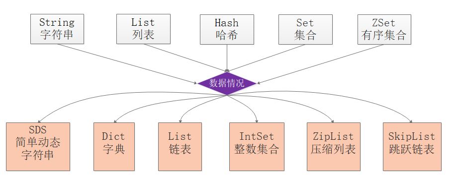
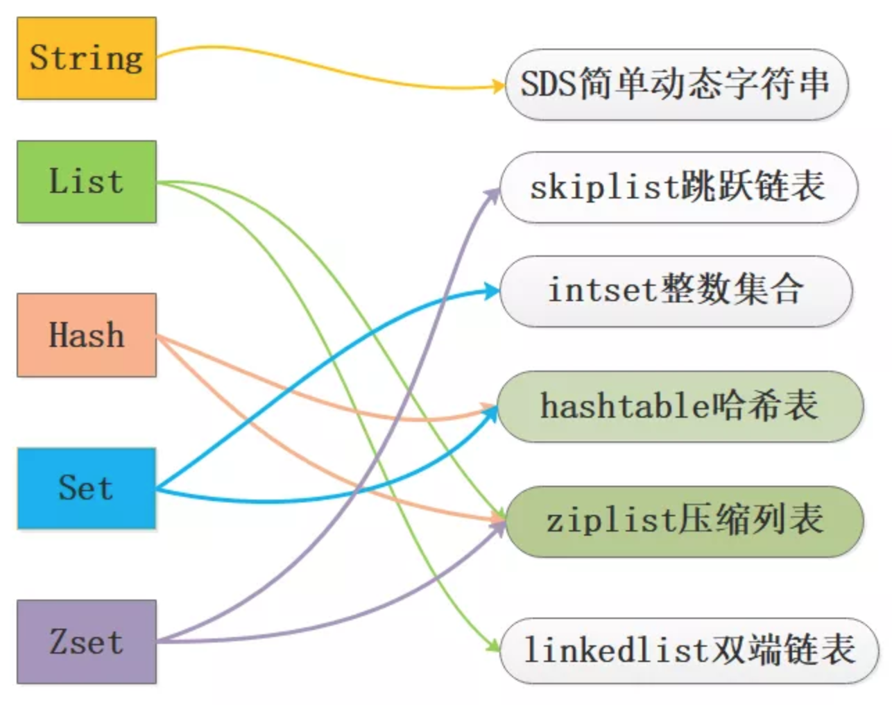

#### Redis 数据结构
| 数据结构 | 说明 |
| --- | --- |
| [adlist](/adlist/) | 链表 |
| [dict](/dict/) | 字典 |
| [intset](/intset/) | 整数集合 |
| [quicklist](/quicklist/)  | 快表 |
| [robj](/robj) | Redis 对象 |
| [sds](/sds/) | 字符串 |
| [ziplist](/ziplist/) | 压缩列表 |
| [zskiplist](/zskiplist/)|跳跃表|

#### 数据结构之间的关系
- 
- 
- [集合对象](/docs/CollectionObject.md/)
- [哈希对象](/docs/HashObject.md/)
- [列表对象](/docs/ListObject.md/)
- [有序集合对象](/docs/OrderedCollectionObject.md/)
- [字符串对象](/docs/StringObject.md/)

#### 疑问
- 在数据量比较小的情况下，Redis 中的很多数据类型，比如字典、有序集合等，都是通过多种数据结构来实现的，为什么会这样设计呢？用一种固定的数据结构来实现，不是更加简单吗？
  - redis的数据结构由多种数据结构来实现，主要是出于时间和空间的考虑，当数据量小的时候通过数组下标访问最快、占用内存最小，而压缩列表只是数组的升级版
  - 因为数组需要占用连续的内存空间，所以当数据量大的时候，就需要使用链表了，同时为了保证速度又需要和数组结合，也就有了散列表

### 参考资料
- 《Redis设计与实现》
- [Redis系列文章——合集](https://mp.weixin.qq.com/s?__biz=MzA4NTg1MjM0Mg==&mid=509777776&idx=1&sn=e56f24bdf2de7e25515fe9f25ef57557&mpshare=1&scene=1&srcid=1010HdkIxon3icsWNmTyecI6#rd)
- [Redis 面试全攻略，读完这个就可以和面试官大战几个回合了](https://mp.weixin.qq.com/s/jLWKxQYOz6vA5aimh44OMg)
- [HyperLogLog 算法的原理讲解以及 Redis 是如何应用它的](https://juejin.im/post/6844903785744056333)